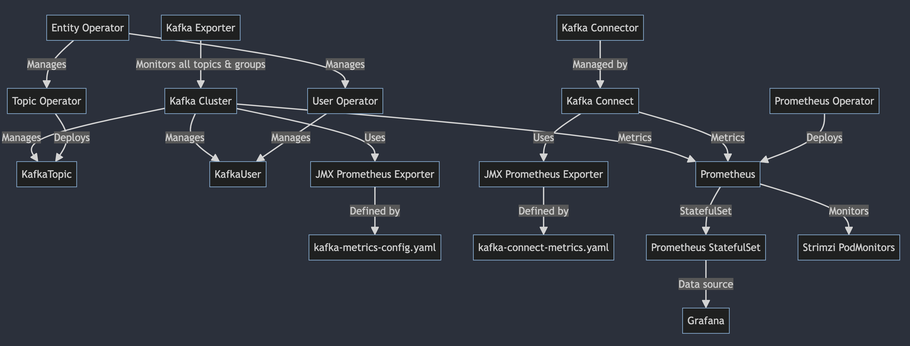
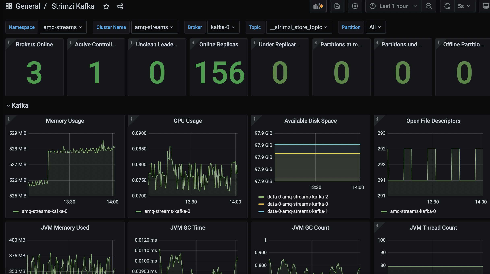

# amq-streams-kafka-metrics
Putting together the components and connecting the dots using Grafana Dashboards, Prometheus, Strimizi Podmonitors, AMQ Streams



## Prerequisites:

Install the following operators
* AMQ Streams
* Prometheus
* Grafana

To use the yaml examples in this lab:
* Replace <your-project> with your own project namespace
* Make sure kafka resources and cluster names match your project

External image registry and source repository access
* Make sure your environment allows your OpenShift cluster to reach out to external image registries and Maven repositories


## Apply the CRD resources in this order
```
Kafka/KafkaConnect:
oc -n <your-namespace> apply -f kafka-metrics-configmap.yaml
oc -n <your-namespace> apply -f kafka-cluster.yaml
oc -n <your-namespace> apply -f kafka-topics.yaml
oc -n <your-namespace> apply -f kafka-connect-demo.yaml
oc -n <your-namespace> apply -f kafka-connect-metrics-example.yaml
oc -n <your-namespace> apply -f kafka-connector-mongodb.yaml

Prometheus:
oc -n <your-namespace> apply -f prometheus-additional-scrape-configmap.yaml
oc -n <your-namespace> apply -f prometheus.yaml
oc -n <your-namespace> apply -f prometheus-strimzi-pod-monitor.yaml

Grafana:
oc -n <your-namespace> apply -f grafana.yaml
oc -n <your-namespace> expose service grafana-service
oc -n <your-namespace> apply -f grafana-datasource.yaml
oc -n <your-namespace> apply -f grafana-*-dashboard.yaml
```

## Post Installation Steps
* Use the grafana route to launch the Grafana console
* Test the Prometheus Data Source connection in Grafana
* If everything is setup and configured correctly following all the steps, you should see dashboards such as these:


